# 🚀 LED Informática - Website Institucional


> Website institucional moderno e responsivo desenvolvido para a LED Informática, focado em soluções de automação comercial e tecnologia.

## 🔗 Link do Projeto (Deploy)

Confira o projeto rodando em produção através do GitHub Pages:

### 👉 [Clique aqui para acessar o Site Online](https://machadojorgeh.github.io/site-led-informatica/)

---

## 📸 Visualização do Projeto

### Home & Banner Principal
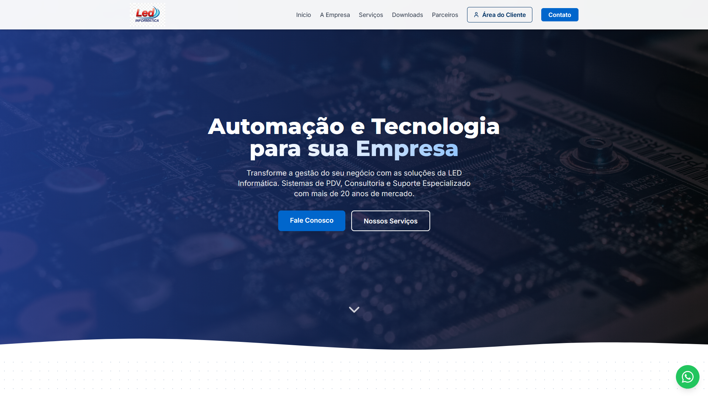

### Seções e Detalhes
| Sobre e Serviços | Detalhes do Serviço |
|:---:|:---:|
| 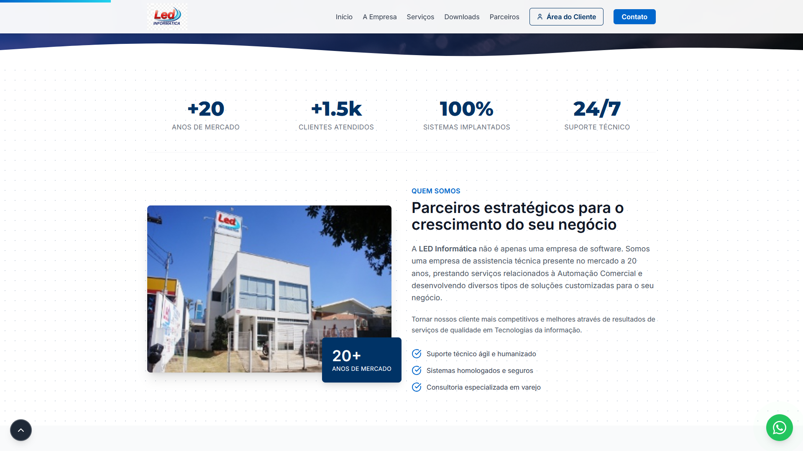 | 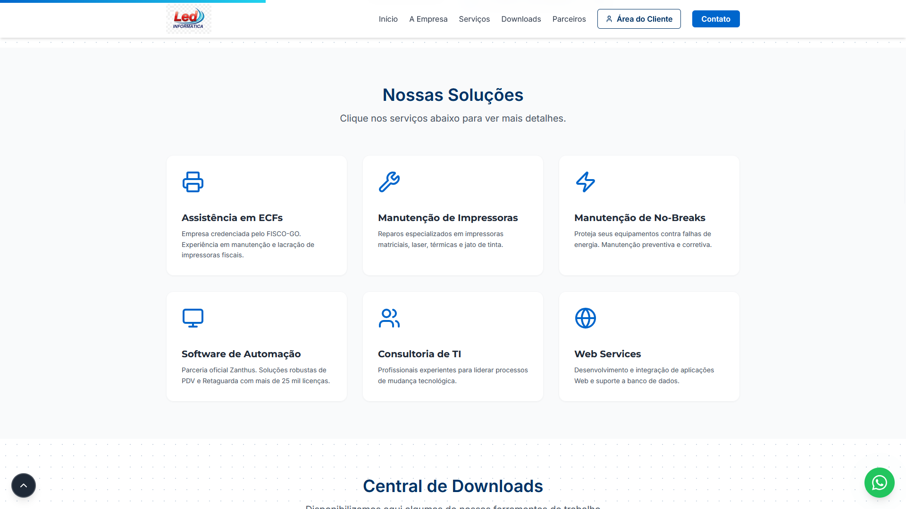 |

| Área de Downloads | Parceiros e Clientes |
|:---:|:---:|
| 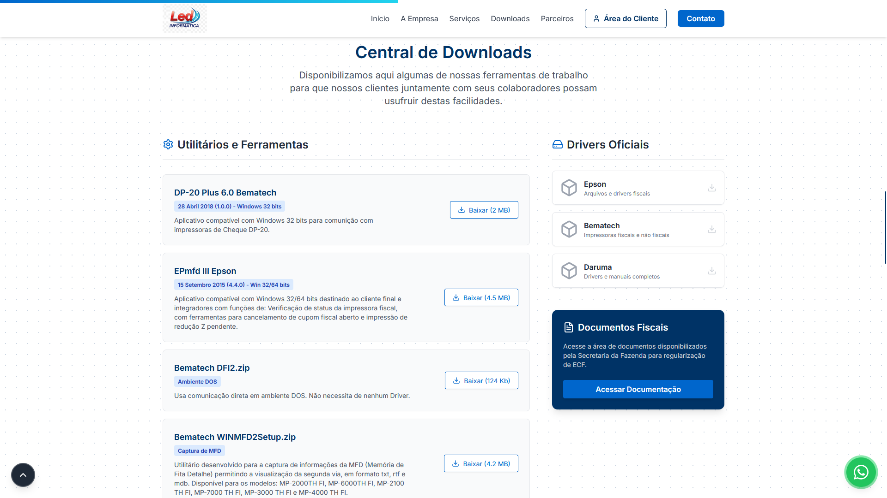 | 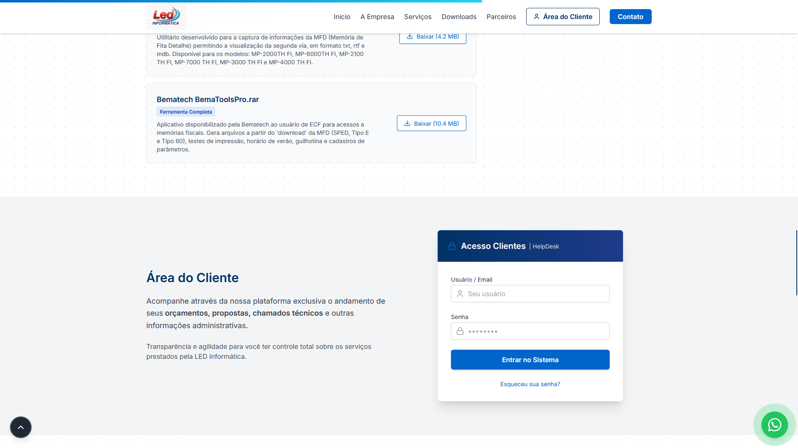 |

### Contato
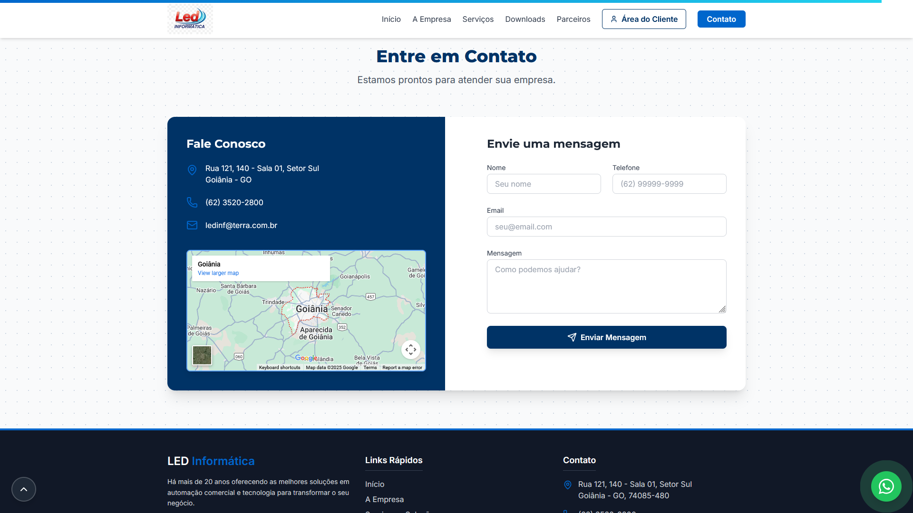 

---

### 📱 Responsividade e Mobile

O layout se adapta perfeitamente a dispositivos móveis, garantindo boa navegação e leitura.

| Sobre a Empresa | Serviços | Downloads |
|:---:|:---:|:---:|
| 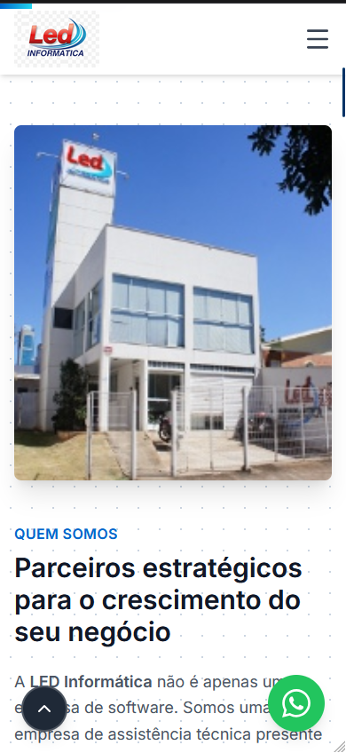 | 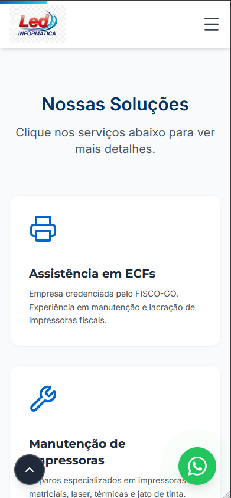 | 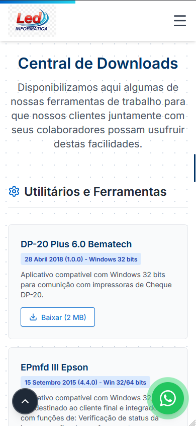 |

| Área do Cliente | Contato e Mapa | Menu e Geral |
|:---:|:---:|:---:|
| 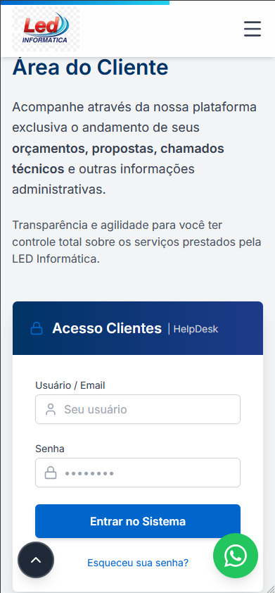 |  | 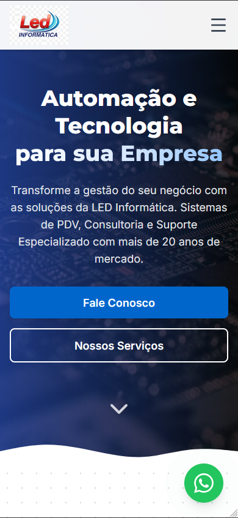 |

---

## 🛠️ Tecnologias Utilizadas

Este projeto foi construído utilizando as melhores práticas de desenvolvimento web moderno:

-   **[React.js](https://react.dev/) (Vite):** Biblioteca principal para construção da interface de usuário com alta performance.
-   **[Tailwind CSS](https://tailwindcss.com/):** Framework CSS utility-first para estilização rápida, responsiva e moderna.
-   **[React Router DOM](https://reactrouter.com/):** Gerenciamento de rotas para navegação SPA (Single Page Application).
-   **[AOS (Animate On Scroll)](https://michalsnik.github.io/aos/):** Biblioteca para animações suaves de entrada dos elementos ao rolar a página.
-   **[Lucide React](https://lucide.dev/):** Conjunto de ícones leves e consistentes.
-   **Google Fonts:** Tipografia personalizada com as famílias *Montserrat* e *Inter*.

## ✨ Funcionalidades

-   ✅ **Design Responsivo:** Adaptável para desktops, tablets e dispositivos móveis.
-   ✅ **Animações Suaves:** Elementos com fade-in, zoom e slide controlados pelo scroll.
-   ✅ **Efeitos Visuais:** Glassmorphism (vidro fosco) no menu, Shine effects (brilho) nos botões e texturas de fundo.
-   ✅ **Navegação SPA:** Transição entre páginas e âncoras sem recarregamento (Scroll suave).
-   ✅ **Componentização:** Arquitetura limpa separando Hero, Services, Partners, Footer, etc.
-   ✅ **Página 404 Personalizada:** Tratamento de rotas inexistentes.

---

## 💻 Como executar o projeto localmente

1.  **Clone o repositório:**
    ```bash
    git clone [https://github.com/MachadoJorgeH/site-led-informatica.git](https://github.com/MachadoJorgeH/site-led-informatica.git)
    ```

2.  **Entre na pasta do projeto:**
    ```bash
    cd site-led-informatica
    ```

3.  **Instale as dependências:**
    ```bash
    npm install
    ```

4.  **Rode o servidor de desenvolvimento:**
    ```bash
    npm run dev
    ```

5.  Acesse `http://localhost:5173` no seu navegador.

---

## 📝 Autor

Desenvolvido por **Jorge Machado**.
Entre em contato: [LinkedIn](https://www.linkedin.com/in/jorge-henrique-machado-b4815494/) | [GitHub](https://github.com/MachadoJorgeH)